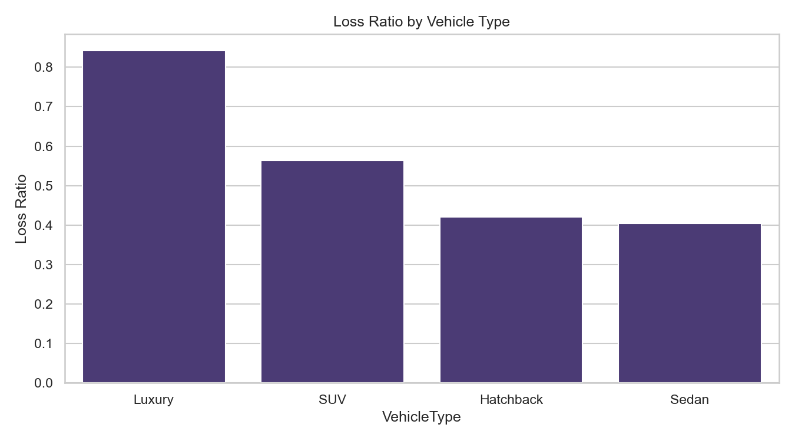
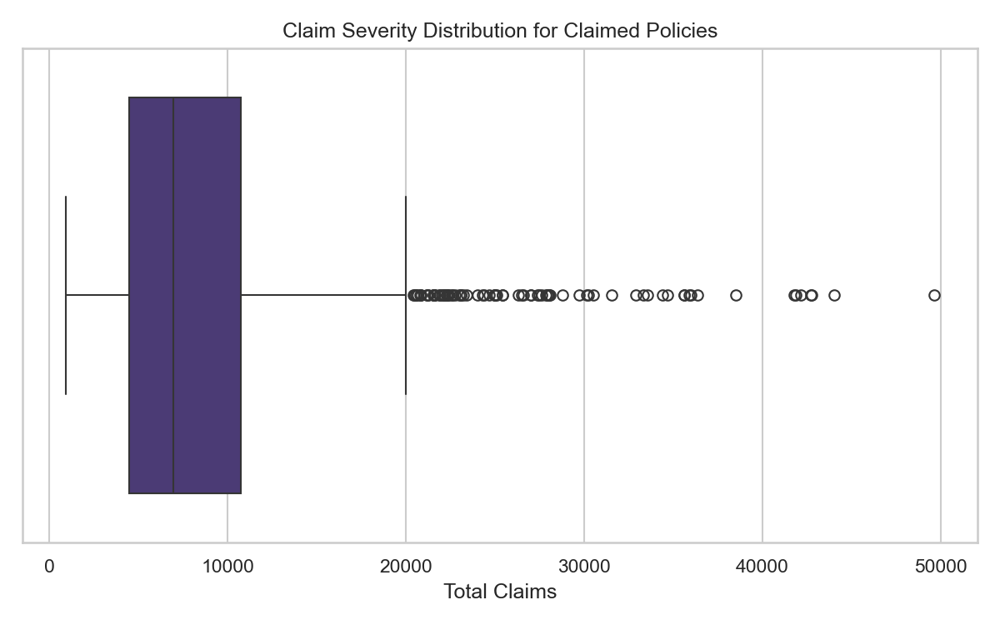
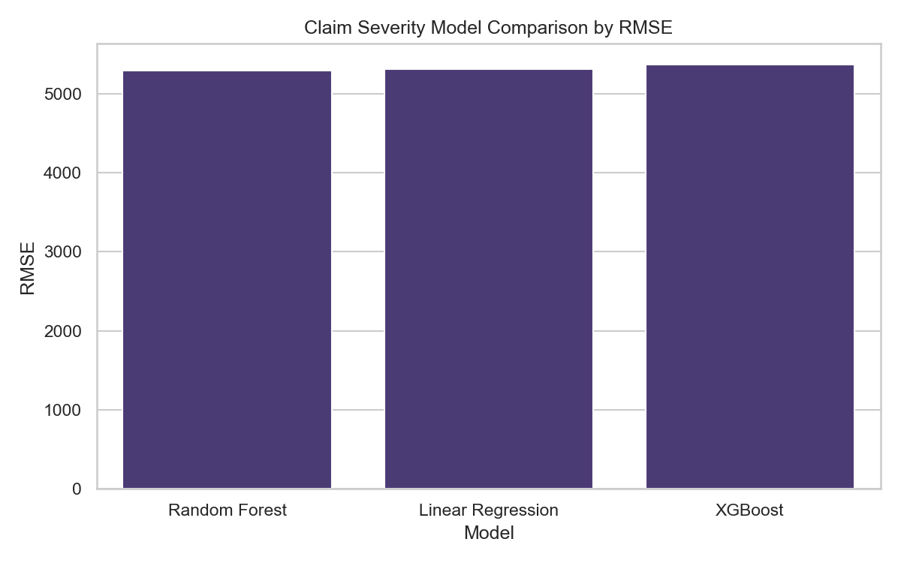
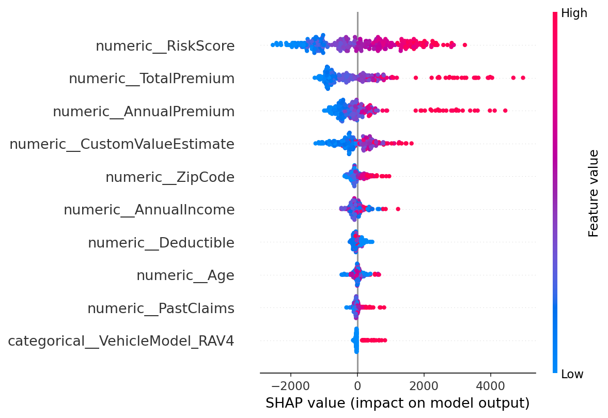

# ACIS Insurance Risk Analytics Final Report

## Executive Summary

AlphaCare Insurance Solutions (ACIS) asked a practical business question: where is the portfolio carrying more risk, and where can pricing or marketing decisions be improved with evidence?

This project analyzed 10,000 cleaned motor-insurance policy records across customer, vehicle, geographic, premium, and claim fields. The portfolio generated total premium of 24,881,279 and total claims of 13,141,885, producing an overall loss ratio of 52.82% and an underwriting margin of 11,739,394.

The strongest business signal is vehicle type. Luxury vehicles have a loss ratio of 84.24%, far higher than SUVs, hatchbacks, and sedans. Province-level differences are visible descriptively, with Somali showing the highest observed loss ratio at 61.19%, but formal hypothesis tests did not find statistically significant claim-occurrence differences at the 5% level. Gender-level risk differences were also not statistically supported.

For claim severity modeling, Random Forest performed best among Linear Regression, Random Forest, and XGBoost, with RMSE of 5,292.09 and R² of 0.208. This is useful as an exploratory pricing signal, but it is not strong enough to support fully automated pricing without further feature engineering, validation, and actuarial review.

The recommendation is to prioritize vehicle-based pricing review, especially Luxury vehicles, while treating geography as a monitoring and investigation dimension rather than an immediate pricing lever. ACIS should avoid gender-based business action from this analysis because the evidence does not support a meaningful difference.

## Methodology

The project followed a reproducible analytics workflow:

1. Load the cleaned ACIS insurance dataset from `data/processed/insurance_data_cleaned.csv`.
2. Validate data quality using row counts, column counts, missing values, and duplicate checks.
3. Calculate insurance KPIs: total premium, total claims, loss ratio, and margin.
4. Compare portfolio performance by province, vehicle type, and gender.
5. Run hypothesis tests for claim occurrence and margin differences.
6. Train claim-severity models using policies with positive claims.
7. Compare model performance using RMSE and R².
8. Interpret the best model using feature importance.

Loss ratio is defined as:

```text
loss ratio = total claims / total premium
```

Margin is defined as:

```text
margin = total premium - total claims
```

Lower loss ratios and higher margins generally indicate more profitable segments.

## Data Quality

The cleaned dataset is in good condition for analysis.

| Metric | Value |
| --- | ---: |
| Rows | 10,000 |
| Columns | 21 |
| Missing values | 0 |
| Duplicate rows | 0 |
| Total premium | 24,881,279 |
| Total claims | 13,141,885 |
| Overall loss ratio | 52.82% |
| Overall margin | 11,739,394 |

No missing values or duplicate records were found in the cleaned dataset. Outliers were not removed automatically because high claims and high-value vehicles can represent real insurance risk.

## Exploratory Data Analysis

### Vehicle Type Is the Clearest Risk Signal

Luxury vehicles stand out as the highest-risk segment by loss ratio.

| Vehicle Type | Policies | Loss Ratio | Margin |
| --- | ---: | ---: | ---: |
| Luxury | 972 | 84.24% | 667,632 |
| SUV | 3,000 | 56.37% | 3,165,771 |
| Hatchback | 2,036 | 42.02% | 2,627,899 |
| Sedan | 3,992 | 40.40% | 5,278,092 |



Luxury vehicles are still profitable in aggregate, but the margin cushion is much thinner relative to premium. ACIS should treat this as the first priority for pricing review.

### Province Differences Exist, but Need Statistical Support

Somali has the highest observed province-level loss ratio, while Amhara has the lowest.

| Province | Policies | Loss Ratio | Margin |
| --- | ---: | ---: | ---: |
| Somali | 1,184 | 61.19% | 1,158,391 |
| Oromia | 2,446 | 53.73% | 2,808,602 |
| Tigray | 804 | 52.60% | 943,556 |
| Addis Ababa | 3,567 | 52.24% | 4,254,164 |
| Amhara | 1,999 | 47.76% | 2,574,681 |


This pattern is useful for monitoring, but the hypothesis tests below do not support a strong claim that province-level claim occurrence differs significantly at the 5% level.

### Gender Differences Are Minimal

Gender-level loss ratios are almost identical.

| Gender | Policies | Loss Ratio | Margin |
| --- | ---: | ---: | ---: |
| Female | 5,138 | 52.87% | 6,028,111 |
| Male | 4,862 | 52.76% | 5,711,283 |

The practical difference is too small to support gender-based pricing action from this analysis.

### Claim Severity Has Outliers

The severity modeling subset contains 1,535 policies with positive claims.



The box plot shows that claim severity is not evenly distributed. This is typical in insurance: a smaller number of larger claims can strongly influence total loss cost.

## DVC and Reproducibility

The project uses a clean data folder structure with raw and processed datasets:

```text
data/
├── raw/
│   └── insurance_data.csv
└── processed/
    └── insurance_data_cleaned.csv
```

The repository includes DVC configuration files, raw data metadata, a pipeline definition, and a lock file. The current DVC pipeline has one stage:

```text
prepare_data: data/raw/insurance_data.csv -> data/processed/insurance_data_cleaned.csv
```

The verified DVC status is:

```text
Data and pipelines are up to date.
```

This means the cleaned dataset can be reproduced from the tracked raw dataset using `dvc repro`. A local DVC remote named `localstorage` is configured at `..\acis-dvc-storage`.

## Hypothesis Testing

The tests used a 5% significance level. None of the tested hypotheses were rejected.

| Hypothesis | Test Used | P-value | Decision | Business Interpretation |
| --- | --- | ---: | --- | --- |
| Claim occurrence differs across provinces. | Chi-square test of independence | 0.0761 | Do not reject null | No statistically significant province-level claim occurrence difference was detected at the 5% level. |
| Claim occurrence differs by gender. | Chi-square test of independence | 0.9638 | Do not reject null | No statistically significant gender-level claim occurrence difference was detected at the 5% level. |
| Claim rate differs between Addis Ababa and Oromia. | Two-proportion z-test | 0.7859 | Do not reject null | No statistically significant claim-rate difference was detected between Addis Ababa and Oromia. |
| Average margin differs between zip codes 10004 and 10002. | Welch's t-test | 0.2642 | Do not reject null | No statistically significant average-margin difference was detected between zip codes 10004 and 10002. |
| Average margin differs between Female and Male. | Welch's t-test | 0.9847 | Do not reject null | No statistically significant average-margin difference was detected between Female and Male. |

For leadership, the key message is simple: the descriptive EDA shows differences worth watching, but the tested differences are not statistically strong enough to justify immediate segment-level pricing changes on their own.

## Predictive Modeling

The modeling task now has two parts. First, a claim-severity model predicts `TotalClaims` for policies where a claim occurred. Second, a claim-frequency model estimates the probability that a policy will have a claim. This separation matters because pricing needs both the likelihood of a claim and the expected cost when a claim occurs.

Three models were compared:

| Model | RMSE | R² |
| --- | ---: | ---: |
| Random Forest | 5,292.09 | 0.2082 |
| Linear Regression | 5,317.07 | 0.2007 |
| XGBoost | 5,370.62 | 0.1845 |



Random Forest performed best by RMSE and also had the highest R². The improvement over Linear Regression is modest, which suggests that the current feature set contains useful signal but not enough to fully explain claim severity.

The R² of 0.208 means the best model explains about 20.8% of the variation in claim severity. This is directionally useful, but not strong enough for automated pricing decisions without more data, additional features, and stronger validation.

The premium framework is:

```text
Pure Premium = P(claim) x Predicted Severity
Technical Premium = Pure Premium + Expense Loading + Risk Load + Profit Margin
```

A sample pricing output is saved to `reports/pricing_framework_sample.csv`. The loadings used in the notebook are placeholders and should be calibrated by actuarial, finance, and compliance teams before operational use.

## Model Interpretability

The best model was interpreted using SHAP-style feature contribution analysis. The top drivers by mean absolute SHAP value were:

| Feature | Mean Absolute SHAP |
| --- | ---: |
| RiskScore | 1,083.20 |
| TotalPremium | 802.85 |
| AnnualPremium | 538.27 |
| CustomValueEstimate | 389.53 |
| ZipCode | 161.13 |
| AnnualIncome | 134.54 |
| Deductible | 91.34 |
| Age | 87.73 |
| PastClaims | 74.70 |
| VehicleModel RAV4 | 72.71 |



The interpretation is business-consistent:

- Premium-related variables are influential because pricing already reflects perceived risk and coverage level.
- `RiskScore` is important, which confirms that the risk scoring feature carries predictive value.
- `CustomValueEstimate` matters because higher-value vehicles can lead to larger claims.
- Geography appears through `ZipCode` and province indicators, suggesting location remains relevant even though the simple hypothesis tests did not reject province-level differences.
- `PastClaims` contributes to severity prediction, but it is not the dominant feature in the current model.

## Recommendations

ACIS should take five specific actions.

First, review Luxury vehicle pricing. The Luxury segment has an 84.24% loss ratio, far above the rest of the portfolio. ACIS should compare premiums, deductibles, repair costs, and claim severity for this group before expanding marketing activity in the segment.

Second, monitor Somali and Oromia as geographic risk areas. Somali has the highest descriptive loss ratio and Oromia has a large policy count with an above-average loss ratio. The hypothesis tests do not justify immediate province-level pricing changes, but these provinces deserve closer monitoring.

Third, avoid gender-based pricing action from this analysis. Gender loss ratios are nearly identical, and the statistical tests do not support a meaningful difference in claim occurrence or margin.

Fourth, use the frequency-severity premium framework as a prototype for actuarial review. The formula is business-correct, but the loadings and model validation need refinement before production pricing.

Fifth, treat the Random Forest model as an exploratory decision-support model, not a production pricing model. It is the best-performing model tested, but the R² is still modest. ACIS should use it to guide feature investigation and pricing conversations, not to automate premium changes.

## Limitations

This analysis has several important limitations.

The DVC workflow is active locally, but it uses a local remote. For team or production use, ACIS should move the DVC remote to shared storage so reviewers can run `dvc pull` without relying on one machine.

The severity model only uses the available structured fields. It does not include richer information such as repair details, accident descriptions, driver history depth, policy tenure, exposure duration, or external geographic risk indicators.

The modeling approach now separates severity from frequency, but the frequency model still needs fuller validation, calibration, and monitoring before use in a production pricing workflow.

Finally, statistical non-significance does not prove that no difference exists. It means the current data and tests did not provide enough evidence at the selected threshold.

## Conclusion

The analysis gives ACIS a clear starting point for risk-based decision-making. The most actionable finding is the high loss ratio for Luxury vehicles. Geographic differences should be monitored, but they are not yet statistically strong enough to drive pricing action by themselves. Gender does not show meaningful evidence of risk difference in the current analysis.

The best severity model is Random Forest, but its predictive power is moderate. The project should now move from exploratory modeling to stronger validation, richer feature engineering, and a fully reproducible DVC pipeline. With those improvements, ACIS can turn this workflow into a more reliable pricing and underwriting decision system.
