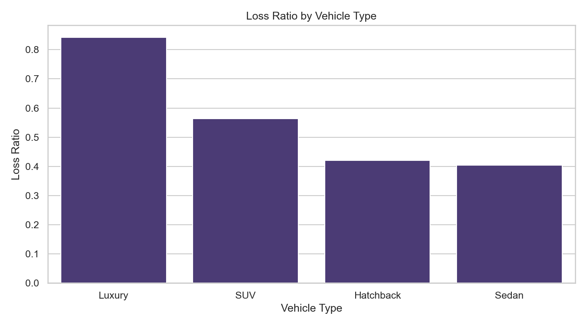
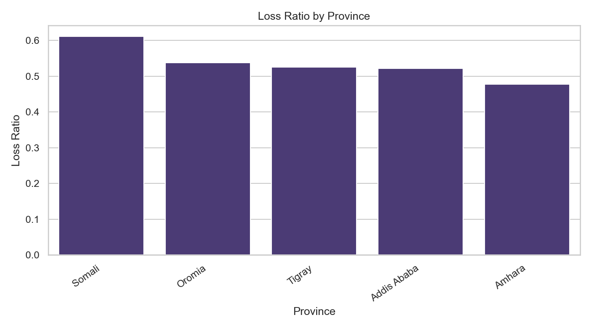
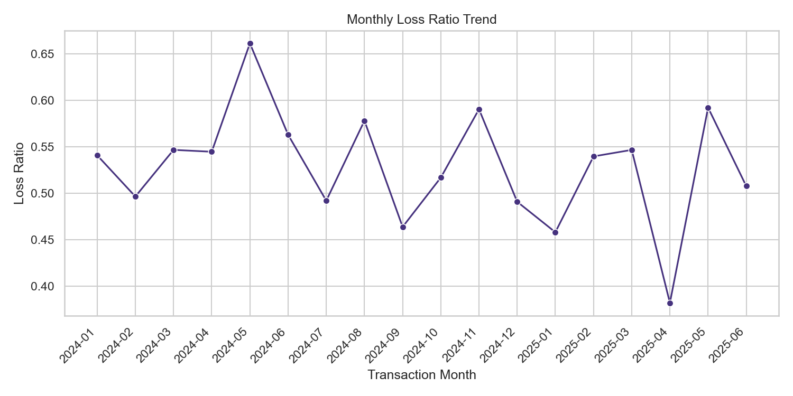

# ACIS Insurance Risk Analytics: Interim Report

## Executive Summary

AlphaCare Insurance Solutions (ACIS) wants to identify low-risk and high-risk segments in its motor insurance portfolio so that pricing, underwriting, and marketing decisions can be made with evidence rather than intuition.

This interim report covers the first analytics milestone: data quality checks, exploratory data analysis, early risk pattern discovery, and reproducibility progress with DVC. The project currently analyzes 10,000 cleaned policy records with 21 original fields. The dataset covers transactions from 2024-01-01 to 2025-06-29, has no missing values after cleaning, and has no duplicate rows.

The early portfolio picture is clear: total premium is 24,881,279, total claims are 13,141,885, and the overall loss ratio is 52.82%. Vehicle type is the strongest visible risk signal so far. Luxury vehicles have a loss ratio of 84.24%, much higher than SUVs, hatchbacks, and sedans. Province-level differences are also visible, with Somali showing the highest observed loss ratio at 61.19%, but these patterns still need formal hypothesis testing before they can be treated as statistically proven.

The project has completed the interim EDA milestone and the follow-on hypothesis testing and modeling work documented in the final report.

## Project Overview

The ACIS project is an end-to-end insurance analytics workflow. The business objective is to discover risk and profitability patterns that can help ACIS answer practical questions:

- Which provinces or zip codes show higher claim risk?
- Which vehicle groups appear underpriced or high severity?
- Do gender-level differences exist after statistical testing?
- Can claim frequency and severity be modeled well enough to support pricing decisions?
- Which features should ACIS monitor when adjusting premiums?

The work is organized into four streams: EDA, DVC reproducibility, hypothesis testing, and predictive modeling.

## Data Quality and Descriptive Statistics

The cleaned dataset is available at `data/processed/insurance_data_cleaned.csv`.

| Metric | Current Value |
| --- | ---: |
| Rows | 10,000 |
| Columns | 21 |
| Missing values | 0 |
| Duplicate rows | 0 |
| Policies with claims | 1,535 |
| Claim rate | 15.35% |
| Total premium | 24,881,279 |
| Total claims | 13,141,885 |
| Overall loss ratio | 52.82% |
| Overall margin | 11,739,394 |

Key descriptive statistics show that claims are highly skewed. The median `TotalClaims` is 0, while the maximum claim is 49,623. This confirms that most policies do not claim, but a smaller number of claim events drive a large share of loss cost.

| Variable | Mean | Std. Dev. | Min | Median | Max |
| --- | ---: | ---: | ---: | ---: | ---: |
| TotalPremium | 2,488.13 | 735.67 | 951 | 2,307 | 5,105 |
| TotalClaims | 1,314.19 | 3,921.86 | 0 | 0 | 49,623 |
| CustomValueEstimate | 35,640.60 | 22,353.99 | 5,022 | 28,522 | 134,914 |
| Margin | 1,173.94 | 3,742.98 | -44,594 | 2,165 | 5,079 |

Business interpretation: the portfolio is profitable overall, but the negative minimum margin shows that some individual policies are materially loss-making. These high-severity cases should be examined rather than removed, because they are exactly the cases that pricing models need to understand.

## EDA Methodology

The EDA focused on the following KPIs:

- `Loss ratio = total claims / total premium`
- `Margin = total premium - total claims`
- `Claim rate = policies with claims / total policies`
- `Average claim = total claims / policy count`

The analysis included univariate, bivariate, and temporal checks:

- Univariate: distributions of premium, claims, vehicle value, and margin.
- Bivariate: loss ratio and claim rate by province, vehicle type, and gender.
- Temporal: monthly loss ratio trend using `TransactionDate`.
- Correlation: relationships among premium, claims, vehicle value, risk score, past claims, and margin.

## Initial EDA Findings

### 1. Vehicle Type Is the Strongest Early Risk Signal



| Vehicle Type | Policies | Claim Rate | Avg. Claim | Loss Ratio | Margin |
| --- | ---: | ---: | ---: | ---: | ---: |
| Luxury | 972 | 28.40% | 3,672.02 | 84.24% | 667,632 |
| SUV | 3,000 | 15.37% | 1,363.56 | 56.37% | 3,165,771 |
| Hatchback | 2,036 | 13.75% | 935.28 | 42.02% | 2,627,899 |
| Sedan | 3,992 | 12.98% | 896.24 | 40.40% | 5,278,092 |

Luxury vehicles are the most important early finding. Their claim rate is almost twice the portfolio average, and their loss ratio is substantially higher than every other vehicle type. This suggests a possible combination of higher repair costs, higher vehicle value, and premium inadequacy.

### 2. Province-Level Differences Are Visible



| Province | Policies | Claim Rate | Avg. Claim | Loss Ratio | Margin |
| --- | ---: | ---: | ---: | ---: | ---: |
| Somali | 1,184 | 17.48% | 1,542.73 | 61.19% | 1,158,391 |
| Oromia | 2,446 | 15.41% | 1,333.22 | 53.73% | 2,808,602 |
| Tigray | 804 | 14.05% | 1,302.41 | 52.60% | 943,556 |
| Addis Ababa | 3,567 | 15.67% | 1,304.52 | 52.24% | 4,254,164 |
| Amhara | 1,999 | 13.96% | 1,177.53 | 47.76% | 2,574,681 |

Somali has the highest observed loss ratio, while Amhara has the lowest. This is a useful underwriting signal, but it is not yet a final conclusion. The next phase will test whether these observed differences are statistically significant.

### 3. Gender Does Not Show a Meaningful Aggregate Difference

| Gender | Policies | Claim Rate | Avg. Claim | Loss Ratio | Margin |
| --- | ---: | ---: | ---: | ---: | ---: |
| Female | 5,138 | 15.38% | 1,316.28 | 52.87% | 6,028,111 |
| Male | 4,862 | 15.32% | 1,311.98 | 52.76% | 5,711,283 |

Gender-level risk looks nearly identical at the aggregate level. Based on EDA alone, gender does not appear to be a strong pricing signal. This will still be tested formally because regulatory and fairness considerations require careful evidence.

### 4. Loss Ratio Changes Over Time



The monthly trend view is important because a stable portfolio should not only be profitable overall; it should also be reasonably stable over time. Any sharp monthly changes in loss ratio should be investigated for claim spikes, seasonality, data capture issues, or changes in business mix.

### 5. Correlation and Outlier Checks

Additional exported EDA figures are available in `reports/figures/`:

- `interim_total_premium_distribution.png`
- `interim_claim_severity_boxplot.png`
- `interim_correlation_heatmap.png`

The outlier check confirms that claim severity has a long tail. This is expected in insurance and should be modeled, not automatically removed. The correlation heatmap will be used to guide feature selection in the modeling stage.

## DVC Setup Progress

The project now has a reproducible data structure:

```text
data/
├── raw/
│   └── insurance_data.csv
└── processed/
    └── insurance_data_cleaned.csv
```

The `prepare_data` stage in `dvc.yaml` defines the raw-to-cleaned workflow:

```bash
python -m src.data_preparation --input data/raw/insurance_data.csv --output data/processed/insurance_data_cleaned.csv
```

Running DVC status reports:

```text
Data and pipelines are up to date.
```

This means the pipeline can currently be reproduced locally with `dvc repro`. The remaining DVC improvement is remote portability: the current remote is local, so a shared remote should be configured before final team review.

## Hypothesis Testing (Completed)

The hypothesis tests were executed in `notebooks/02_hypothesis_testing.ipynb` and exported to `reports/hypothesis_test_results.csv`.

| Business Question | Test Used | P-value | Decision |
| --- | --- | ---: | --- |
| Claim occurrence differs across provinces | Chi-square test | 0.0761 | Do not reject null |
| Claim rate differs between Addis Ababa and Oromia | Two-proportion z-test | 0.7859 | Do not reject null |
| Average margin differs between zip codes 10004 and 10002 | Welch's t-test | 0.2642 | Do not reject null |
| Claim occurrence differs by gender | Chi-square test | 0.9638 | Do not reject null |
| Average margin differs between Female and Male | Welch's t-test | 0.9847 | Do not reject null |

At the 5% significance level, none of the tested hypotheses were rejected. Descriptive EDA patterns remain useful for monitoring, but they are not statistically strong enough on their own to justify immediate segment-level pricing changes.

## Modeling and Pricing (Completed)

The modeling workflow in `notebooks/03_modeling.ipynb` separates claim frequency from claim severity:

- Frequency model: Random Forest classifier estimates `P(claim)`.
- Severity model: Random Forest regressor predicts `TotalClaims` for policies with claims.

Best severity model: Random Forest (RMSE 5,292.09, R² 0.208). Claim-frequency metrics are saved in `reports/claim_frequency_model_metrics.csv`.

The pricing framework uses:

```text
Pure Premium = P(claim) × Predicted Severity
Technical Premium = Pure Premium + Expense Load + Risk Load + Profit Margin
```

A sample pricing output is available in `reports/pricing_framework_sample.csv`. SHAP-based interpretability outputs are in `reports/shap_top_features.csv` and `reports/figures/shap_summary_claim_severity.png`.

Full business recommendations and limitations are documented in `reports/final_report.md`.

## Remaining Open Items

The analytical workflow is complete. The main operational follow-ups are:

- Move the DVC remote from local storage to shared storage for easier team review.
- Calibrate expense, risk, and profit loadings with actuarial and finance teams before production pricing.
- Validate models on holdout or out-of-time data before operational deployment.

## Interim Conclusion

The interim milestone is complete. The dataset is clean, EDA shows clear risk variation (especially Luxury vehicles and Somali province), hypothesis testing provides statistical context, and the frequency-severity modeling pipeline produces pricing-ready outputs. ACIS can use `reports/final_report.md` as the consolidated business deliverable.